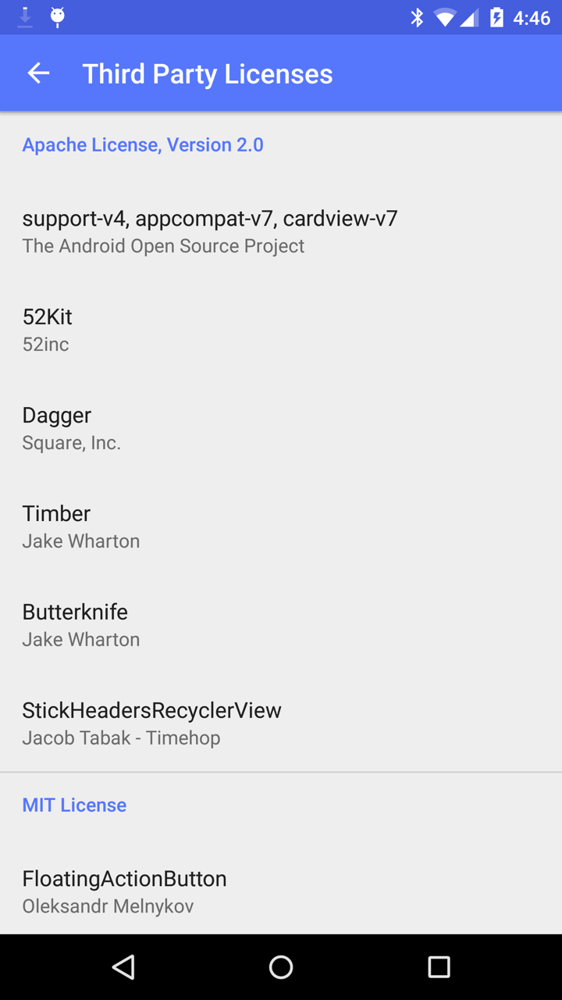
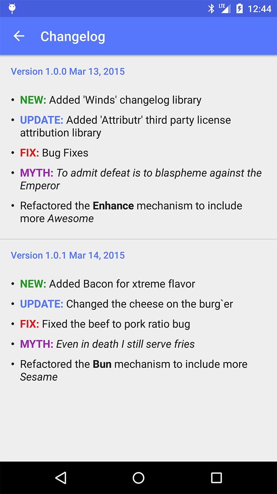

# 52Kit
[](https://maven-badges.herokuapp.com/maven-central/com.52inc/52Kit)  
Library that acts as the foundation to building our android applications.

## Sections

### Preferences

This library includes several dependency injection ready Preference helper classes and an AES-256 Encryption wrapper for SharedPreferences. See [here](https://github.com/52inc/android-52Kit/tree/master/library/src/main/java/com/ftinc/kit/preferences) for further documentation.

### Utilities

This library also includes a handful of utility classes that contain convienence functions for a variety of tasks. You can view the source [here](https://github.com/52inc/android-52Kit/tree/master/library/src/main/java/com/ftinc/kit/util) which includes these utilities:

*	`Utils.java` - A generic utility class that contains basic helper functions
*	`BuildUtils.java` - A utility class with functions that focus around the build of the device, i.e. the OS.
*	`ColorUtils.java` - A utility class that deals with colors
*	`FileUtils.java` - A utility class that contains helper functions for dealing with file transactions
*	`IntentUtils.java` - A utility class that provides a lot of `Intent` creating functions
*	`TimeUtils.java` - A utility class for functions that deal with time and formatting time
*	`UIUtils.java` - A utility class for helper functions that deal with the UI and views
*	`FormatUtils.java` - A utility class for formatting text and generating hash strings

---

### Attributr

Attributr, formaly found [here](https://github.com/52inc/Attributr), is a library for easily displaying a list of license attributions for the 3rd party libraries in your application.

#### Usages

*	**Configuration File**

```xml
	<Library license="apache">
	    <Name>52Kit</Name>
	    <Author>52inc</Author>
	    <Year>2015</Year>
	    <Description>A library with common tools for building Android applications</Description>
	    <Url>https://github.com/52inc/android-52Kit</Url>
	    <Email>support@52inc.com</Email>
	</Library>
```
		
*	**Implementation**

	```java
	Attributr.openLicenses(context, R.xml.config);
	```
	
* 	**Screenshot**



---

### Winds - ChangeLog component

Winds, as in _Winds of Change_, is a utility for displaying a changelog to the user.

#### Usages

*	**Configuration File**  
Default: `R.xml.changelog`


	```xml
	<?xml version="1.0" encoding="utf-8"?>
	<Changelog>
	
	    <Version code="1" name="1.0.0" date="Mar 13, 2015">
	        <Change type="new">Added 'Winds' changelog library</Change>
	        <Change type="update">Added 'Attributr' third party license attribution library</Change>
	        <Change type="fix">Bug Fixes</Change>
	        <Change type="mythical">To admit defeat is to blaspheme against the Emperor</Change>
	        <Change>Refactored the [b]Enhance[/b] mechanism to include more [i]Awesome[/i]</Change>
	    </Version>
	
	    <Version code="2" name="1.0.1" date="Mar 14, 2015">
	        <Change type="new">Added Bacon for xtreme flavor</Change>
	        <Change type="update">Changed the cheese on the burg`er</Change>
	        <Change type="fix">Fixed the beef to pork ratio bug</Change>
	        <Change type="mythical">Even in death I still serve fries</Change>
	        <Change>Refactored the [h1]Bun[/h1] mechanism to include more [h2]Sesame[/h2]</Change>
	    </Version>
	
	</Changelog>
		
	```

* **Implementation**  
You can show the changelog as easily as calling:

	```java
	Winds.gust(context);
	```  
	
	This will use the default changelog configuration located at `R.xml.changelog` which you can override or create your own an d implement by calling:
	
	```java
	Winds.gust(context, R.xml.someother_changelog);
	```
	
 	If you want to show a changelog on app startup for new versions/updates all you have to do is call this one line:
 	
 	```java
 	Winds.checkChangelogActivity(context); 
 	```
 	
 	Which will check the default `R.xml.changelog` resource. If you want to specify a different name just call the following
 	
 	```java
 	Winds.checkChangelogActivity(context, R.xml.other_changelog);
 	```
 	
*	**Screenshot**




---

### Widgets

See [here](https://github.com/52inc/android-52Kit/tree/master/library/src/main/java/com/ftinc/kit/widget) for a list of pre-built widgets and views. 

### Font

See [here](https://github.com/52inc/android-52Kit/tree/master/library/src/main/java/com/ftinc/kit/font) for a Utility, FontLoader, that can easily apply Roboto typefaces to textviews.

### Adapters

See [here](https://github.com/52inc/android-52Kit/tree/master/library/src/main/java/com/ftinc/kit/adapter) for Subclassed List and Recycler Adapters that make it easier to build list views

### Pre-built layout files
Pre-built layouts for common list item configurations includeing, one line, two line, and three line items with and without avatars.

## Including in your project

Include this line in your gradle build file:

```groovy
compile 'com.52inc:kit:{current_version}'
```
